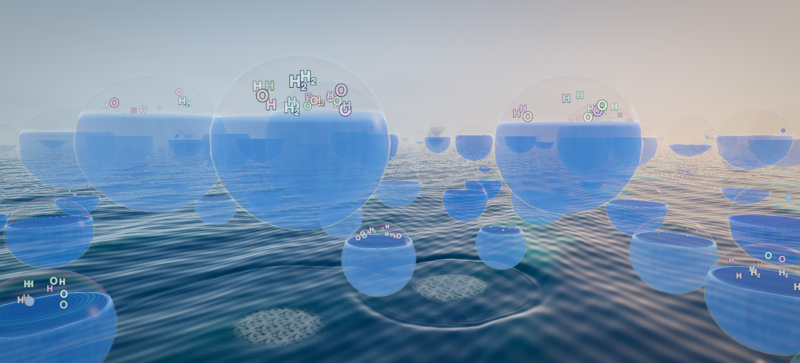
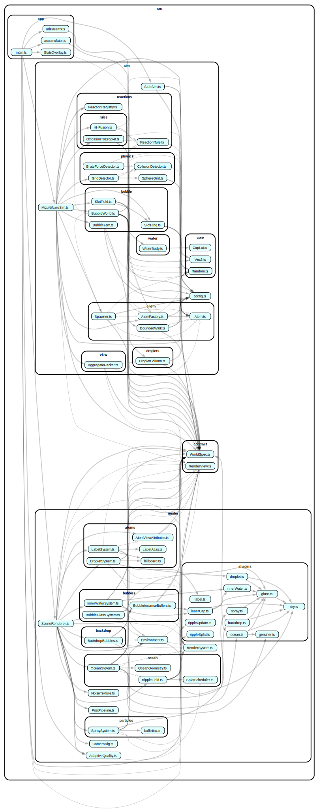

# 水になる (mizu-ni-naru)

**ぼーっと眺める水の世界**

H と O がぶつかって水になり、球体を満たして海へ還っていく。そんな作品です。  
WebGLを使っています。

## デモ

https://mizu-ni-naru.orukubami.sh



## 操作

カメラは自動でゆっくりと漂います。

- ドラッグすると、カメラを回転できます。
- ホイールまたはピンチで、ズームできます。
- 操作をやめると、約 5 秒後に自動移動へ戻ります。
- 端末で「視差効果を減らす」などが設定されている場合は、カメラの自動移動を停止します。

## Mizuシリーズ

Mizuシリーズの最新作です。（2026/07/12 現在）

- https://github.com/shimabox/mizu-ni-naru 👈️
  - WebGL
- https://github.com/shimabox/Mizu-go
  - Go（Ebitengine）
- https://github.com/shimabox/Mizu-ts
  - TypeScript
- https://github.com/shimabox/Mizu
  - JavaScript

## ローカルでの開発

Node.js 22 と npm を使用します。Node.js のバージョンは [mise](https://mise.jdx.dev) で管理しているため、あらかじめ mise をインストールしてください。

リポジトリを取得し、依存パッケージをインストールします。

```sh
git clone https://github.com/shimabox/mizu-ni-naru.git
cd mizu-ni-naru
mise install
npm install
```

開発サーバーを起動します。

```sh
npm run dev
```

ブラウザで http://localhost:5173 を開くと確認できます。ソースコードを変更すると、自動的に画面へ反映されます。

主なコマンドは次のとおりです。

|コマンド|内容|
|:---|:---|
|`npm run dev`|開発サーバーを起動します。|
|`npm run build`|型検査と本番ビルドを実行します。|
|`npm run test`|テストを実行します。|
|`npm run lint`|静的検査を実行します。|
|`npm run typecheck`|型検査を実行します。|
|`npm run depcruise`|レイヤー間の依存関係を検査します。|

<details>
<summary>URL パラメータ</summary>

|パラメータ|内容|
|:---|:---|
|`seed`|同じ世界を再現するための乱数シードを指定します。|
|`m=1`|計測オーバーレイを表示します。|
|`q=0..4`|画質を固定します。0 が最高画質です。|
|`dpr`|`devicePixelRatio` の上限を指定します。|
|`sim=stub`|描画確認用のシミュレーションに切り替えます。|
|`slots`|球体の数を指定します。|

例: http://localhost:5173/?seed=7&m=1

</details>

## アーキテクチャ

シミュレーションと描画を分離した 4 層構成です。

```text
contract/   sim と render をつなぐ型と定数
sim/        DOM や Three.js に依存しないシミュレーション
render/     Three.js による描画
app/        初期化とアプリケーションループ
```

依存方向は dependency-cruiser で検査しています。

<details>
<summary>依存関係グラフ</summary>



`npm run dependency-graph` でグラフを更新できます。実行には Graphviz が必要です。

</details>

## デプロイ

`npm run build` で生成される `dist/` を静的ホスティングへ配置すると動作します。

## 開発ドキュメント

- [パフォーマンス計測ツールの使い方](docs/performance/README.md)
- [設計・計測・検証の作業ログ](docs/README.md)

## ライセンス

[MIT](LICENSE)
